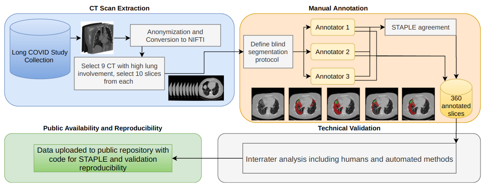
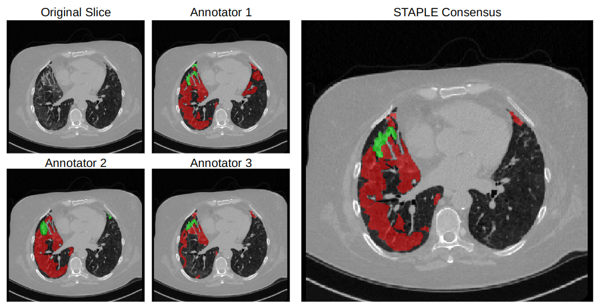

# Long COVID Iowa-UNICAMP dataset

Download link: under submission.

Thanks for downloading the Long COVID Iowa-UNICAMP dataset. If you use this data, please cite our dataset paper.

A paper accompanying this dataset is under submission, and this description will be updated to include its reference in the future. 

# Abstract

The field of supervised automated medical imaging segmentation suffers from the lack of annotated groundtruth data. This problem is even more noticeable when dealing with the segmentation of multiple types of lung findings in computed tomography with uncertain borders, such as opacities and parenchymal consolidation resulting from pneumonia. In this work, we make available the first public dataset of ground glass opacity and consolidation in the lung of Long COVID patients. The Long COVID Iowa-UNICAMP dataset (LongCIU) was built by three independent expert annotators, blindly segmenting the same 90 selected axial slices manually, without using any automated initialization. We make available not only the final consensus segmentation, but also the individual segmentation from each annotator totaling 360 slices. This dataset can be used to train and validate new automated segmentation methods and to study interrater uncertainty in lung opacities' segmentation on computed tomography. 

|  | 
|:--:| 
| *Overview of the dataset creation process.* |

|  | 
|:--:| 
| *Sample CT scan slice, accompanying annotations, and final STAPLE consensus.* |

# Directory tree

The "longciu.zip" file provided in the download link should contain the following files:

.\
├── longciu_1_tgt.nii.gz\
├── longciu_2_tgt.nii.gz\
├── longciu_3_tgt.nii.gz\
├── longciu_img.nii.gz\
├── longciu_medpseg_output.nii.gz\
├── longciu_splits.json\
├── longciu_STAPLE_tgt.nii.gz\
├── README.md\
└── staple_pub_stats.json

File tree for the dataset, including images, annotations per annotator and consensus, MEDPSeg output, optional proposed training splits, and STAPLE statistics. .nii.gz formats can be read using libraries such as SimpleITK or NiBabel.

## longciu_X_tgt.nii.gz
Results from blind annotations from annotator 1, 2, and 3.
 
## longciu_img.nii.gz
Anonymized CT scan slices used for annotation, in original HU intensities. 

CT scan data was originally collected at the University of Iowa Hospitals and Clinics, in an ongoing Long COVID study. Adults with history of COVID-19 infection confirmed by a positive antigen or reverse transcriptase-polymerase chain reaction that remained symptomatic 30 days or more following diagnosis were prospectively enrolled starting in June 2020. Patient data collected included age, sex, CT scan, days between acute COVID-19 diagnosis and CT scan, vaccination status, comorbidities, and other information. Chest CT scans were conducted with Siemens scanners. All scans employed tube current modulation. A standardized protocol for noncontrast chest CT imaging was followed, which entailed acquiring an inspiratory scan at total lung capacity (TLC) and an expiratory scan at residual volume (RV). Reconstruction of images was performed using iterative reconstruction techniques with a section thickness x interval of 1 x 0.5 mm. This study was performed in line with the principles of the Declaration of Helsinki. Study protocols were approved by the institutional review board and were Health Insurance Portability and Protection Act–compliant. Participants were required to sign written informed consent before inclusion, including the possibility of sharing anonymized images.

## longciu_medpseg_output.nii.gz
Output from the MEDPSeg[1] model, which was not trained in this dataset.

## longciu_splits.json
Optional, proposed data splits. 

## longciu_STAPLE_tgt.nii.gz
Final consensus segmentation, using STAPLE[2]. 

## README.md
A short description of the dataset.

## staple_pub_stats.json
Output statistics from the SimpleITK STAPLE implementation, for reproducibility. 

# Code 

The software repository for this project is: https://github.com/MICLab-Unicamp/LongCIU

Source code to reproduce the STAPLE consensus, sample training, and evaluation examples, is available at: https://github.com/MICLab-Unicamp/LongCIU/tree/main/src. The GitHub repository presents the minimum code necessary to reproduce processing and technical validation involved in making our annotations of GGO and Consolidations in Long COVID patients available, including interrater results included in the paper (in the interrater.ipynb notebook). Use the requirements.txt file to create an python environment suitable to run the code if necessary.

# References

[1] Carmo, Diedre S., et al. "MEDPSeg: Hierarchical polymorphic multitask learning for the segmentation of ground-glass opacities, consolidation, and pulmonary structures on computed tomography" arXiv preprint arXiv:2312.02365 (2024).

[2] Warfield, Simon K., Kelly H. Zou, and William M. Wells. "Simultaneous truth and performance level estimation (STAPLE): an algorithm for the validation of image segmentation." IEEE transactions on medical imaging 23.7 (2004): 903-921.
